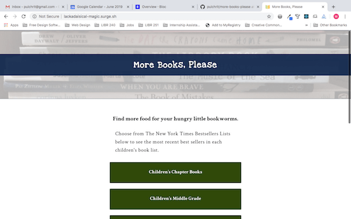

# More Books, Please
More Books, Please is a web app that pulls the names of only children's best sellers lists from the New York Times API and displays these lists
as options to the user. The user can click on any list name to see the top books in each NYT Best Sellers List. Each book includes an external link to either the book's Amazon page or the book's OpenLibrary page. 

## Live site
http://melissalafranchise.com/more-books-please/index.html

## Technologies used
- HTML, CSS, Javascript, React, React Router
- Mobile-first, responsive design
- Fetch API
- New York Times API
- Open Library API

This project was bootstrapped with [Create React App](https://github.com/facebook/create-react-app).

